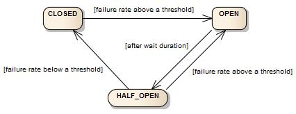

**Overview** 

Resilience4j is a lightweight, functional fault tolerance library designed for Java 8 and above. The Circuit Breaker pattern prevents a system from making repeated calls to a failing service, thereby improving stability and resilience. 

The CircuitBreaker is implemented via a finite state machine with three states: CLOSED, OPEN and HALF_OPEN.  
**Closed State:** 
In the Closed state, the circuit breaker operates normally, allowing requests to flow through between services. During this phase, the circuit breaker monitors the health of the downstream service by collecting and analyzing metrics such as response times, error rates, or timeouts. 

**Open State:** 
When the monitored metrics breach predetermined thresholds, signaling potential issues with the downstream service, the circuit breaker transitions to the Open state.In the Open state, the circuit breaker immediately stops forwarding requests to the failing service, effectively isolating it. 

**Half-Open State:** 
1.After a specified timeout period in the Open state, transitions to Half-Open state. 
2. Allows a limited number of trial requests to pass through to the downstream service. 
3. If trial requests succeed, indicating service recovery, transitions back to Closed state. 
4. If trial requests fail, service issues persist. 
5. May transition back to Open state or remain in Half-Open state for further evaluation. 

**Project Structure** 

src/main/java/com/example/circuitbreaker/ 
 
│── CircuitGradleApplication.java   # Main application class 

│── controller/ 

│   ├── CbController.java           # REST Controller with Circuit Breaker 

│── service/ 

│   ├── CbService.java              # Service calling external API 

│── resources/ 

│   ├── application.yml             # Configuration file 

**Project Dependencies** 

Project includes the following key dependencies required for using Resilience4j with Spring Boot 3: 

 
dependencies { 
    implementation("org.springframework.boot:spring-boot-starter-actuator") 
    implementation("org.springframework.boot:spring-boot-starter-web") 
    implementation("io.github.resilience4j:resilience4j-spring-boot3") 
    implementation("org.springframework.boot:spring-boot-starter-aop") 
} 

 
  

resilience4j-spring-boot3: Provides integration of Resilience4j into Spring Boot 3 applications. 

spring-boot-starter-aop: Enables aspect-oriented programming, which is required for annotation-based circuit breakers. 

spring-boot-starter-actuator: Allows monitoring and management of circuit breakers. 

**Configuration** 

**1. Configuring Circuit Breaker Properties** 

Define Circuit Breaker settings in application.yml: 

resilience4j: 
  circuitbreaker: 
    instances: 
      myService: 
        failureRateThreshold: 50 
        slowCallRateThreshold: 50 
        slowCallDurationThreshold: 2s 
        slidingWindowType: COUNT_BASED 
        slidingWindowSize: 10 
        minimumNumberOfCalls: 5 
        waitDurationInOpenState: 10s 
        permittedNumberOfCallsInHalfOpenState: 3 
        automaticTransitionFromOpenToHalfOpenEnabled: true 
  

**Key Properties Explained** 

failureRateThreshold: If 50% of requests fail, the circuit will open. 

slowCallRateThreshold: If 50% of calls are slow (above slowCallDurationThreshold), the circuit will open. 

slidingWindowType: Uses a count-based window. 

slidingWindowSize: Uses the last 10 calls for calculations. 

minimumNumberOfCalls: Requires at least 5 calls before activating. 

waitDurationInOpenState: After 10s, it moves to half-open state. 

permittedNumberOfCallsInHalfOpenState: Allows 3 requests in half-open state. 

automaticTransitionFromOpenToHalfOpenEnabled: Automatically moves to half-open when time expires.

**Implementation** 

**2. Applying Circuit Breaker**  

Annotate methods with @CircuitBreaker to handle failures automatically: 

@RestController 

public class CbController { 

    private final CbService cbService; 

  

    public CbController(CbService cbService) { 

        this.cbService = cbService; 

    } 

  

    @GetMapping("/universities") 

    @CircuitBreaker(name = "CircuitBreaker", fallbackMethod = "getUniversitiesFallback") 

    public List<Object> getUniversities() throws Exception { 

        return cbService.getUniversities(); 

    } 

  

    public List<Object> getUniversitiesFallback(Throwable throwable) { 

        System.out.println("Fallback triggered: " + throwable.getMessage()); 

        return List.of("Universities service unavailable!"); 

    } 

} 

 
**Explanation:** 

@CircuitBreaker(name = "CircuitBreaker", fallbackMethod = "getUniversitiesFallback") 

If getUniversities() fails, the fallback method getUniversitiesFallback() is executed. 

The fallback method must have the same return type as the original method. 

 **3. Service Layer (Calling External API)** 

@Service 

public class CbService { 

    private final RestTemplate restTemplate; 

  

    public CbService(RestTemplate restTemplate) { 

        this.restTemplate = restTemplate; 

    } 

  

    public List<Object> getUniversities() throws Exception { 

        Object[] universities = null; 

        try { 

            universities = restTemplate.getForObject("http://universities.hipolabs.com/search?country=United+States", Object[].class); 

        } catch (Exception e) { 

            throw new Exception("Failed to fetch universities from the API"); 

        } 

        return Arrays.asList(universities).subList(1, 10); 

    } 

} 

 

 
**Explanation:** 

Calls an external universities API. 

Throws an exception if the API is down. 

The Circuit Breaker in CbController prevents multiple failed calls from overloading the service. 

**Summary**

1.Circuit breaker starts in Closed state.

2.If more than 50% of last 10 requests fail, it opens for 5 seconds.

3.During Open state, requests are immediately rejected and fallback is called.

4.After 5 seconds, it moves to Half-Open and allows 3 test requests.

5.If those succeed, it goes back to Closed, else it stays Open.

